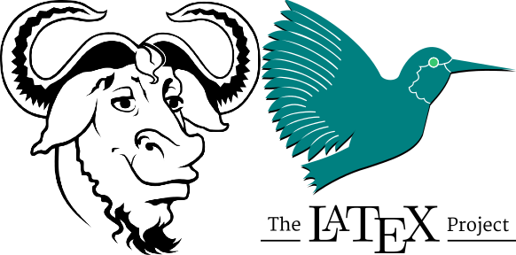

# 📚 LaTeX Lab Experiments - VTU BCSL456D

<p align="center">
  
</p>

<h1 align="center">LaTeX Lab Experiments - VTU</h1>
<h3 align="center">Technical Writing Using LaTeX (BCSL456D)</h3>

<p align="center">
  <a href="#-what-is-latex">Introduction</a> •
  <a href="#-about-this-course">Course</a> •
  <a href="#-lab-programs-overview">Lab Programs</a> •
  <a href="#-quick-start-with-overleaf">Quick Start</a> •
  <a href="#-viva-questions--preparation">Viva</a> •
  <a href="#-contributing">Contributing</a>
</p>

<p align="center">
  
  
  
  
</p>

---

## 📚 What is LaTeX?

**LaTeX** (pronounced *Lay-tech* or *Lah-tech*) is a sophisticated document preparation system designed for high-quality typesetting. It is particularly well-suited for technical and scientific documentation, making it an essential tool for:

- Research papers and journals
- Technical documentation
- Academic theses and dissertations
- Mathematical and scientific documents
- Professional presentations
---

## 🏫 About This Course

**Subject Code:** BCSL456D  
**Course Name:** Technical Writing Using LaTeX  
**University:** Visvesvaraya Technological University (VTU)

This repository covers the VTU course "Technical Writing Using LaTeX" (BCSL456D). The course aims to equip students with the skills needed to create professional technical documents using LaTeX.

### Course Resources
- ✅ All 12 lab programs with source code and outputs
- 📋 [VTU Syllabus PDF](Latex%20Syllabus.pdf)
- ❓ [LATEX VIVA Questions](LATEX-VIVA.pdf)
- 🔗 Learning resources and tutorials

> 💡 **New to LaTeX?** Check out our [Quick Start Guide](#-quick-start-with-overleaf) to begin learning LaTeX in just 30 minutes!

---

## 🧪 Lab Programs Overview

| No. | Program Description | Difficulty | Source Code | Output PDF |
|-----|-------------------|------------|-------------|------------|
| 1 | Document with Sections, Headers & Footers | 🟢 Beginner | [📄 View Code](Latex_lab/Program1/First.tex) | [📤 View PDF](Latex_lab/Program1/First.pdf) |
| 2 | Abstract/Summary Layout Design | 🟢 Beginner | [📄 View Code](Latex_lab/Program2/Second.tex) | [📤 View PDF](Latex_lab/Program2/Second.pdf) |
| 3 | VTU Project Title Page | 🟡 Intermediate | [📄 View Code](Latex_lab/Program3/Third.tex) | [📤 View PDF](Latex_lab/Program3/Third.pdf) |
| 4 | Certificate Page Design | 🟡 Intermediate | [📄 View Code](Latex_lab/Program4/Fourth.tex) | [📤 View PDF](Latex_lab/Program4/Fourth.pdf) |
| 5 | Student Marks Table | 🟡 Intermediate | [📄 View Code](Latex_lab/Program5/Fifth.tex) | [📤 View PDF](Latex_lab/Program5/Fifth.pdf) |
| 6 | Side-by-side Graphics | 🟡 Intermediate | [📄 View Code](Latex_lab/Program6/Sixth.tex) | [📤 View PDF](Latex_lab/Program6/Sixth.pdf) |
| 7 | Mathematical Equations | 🟡 Intermediate | [📄 View Code](Latex_lab/Program7/Seventh.tex) | [📤 View PDF](Latex_lab/Program7/Seventh.pdf) |
| 8 | Theorems & Definitions | 🔴 Advanced | [📄 View Code](Latex_lab/Program8/Eight.tex) | [📤 View PDF](Latex_lab/Program8/Eight.pdf) |
| 9 | Bibliography & Citations | 🔴 Advanced | [📄 View Code](Latex_lab/Program9/Ninth.tex) | [📤 View PDF](Latex_lab/Program9/Ninth.pdf) |
| 10 | Tree Diagram using TikZ | 🔴 Advanced | [📄 View Code](Latex_lab/Program10/Tenth.tex) | [📤 View PDF](Latex_lab/Program10/Tenth.pdf) |
| 11 | Algorithm Formatting | 🔴 Advanced | [📄 View Code](Latex_lab/Program11/Eleventh.tex) | [📤 View PDF](Latex_lab/Program11/Eleventh.pdf) |
| 12a | Report Format Design | 🔴 Advanced | [📄 View Code](Latex_lab/Program12a/twevelth_a.tex) | [📤 View PDF](Latex_lab/Program12a/twevelth_a.pdf) |
| 12b | Article Format Design | 🔴 Advanced | [📄 View Code](Latex_lab/Program12b/Twevelthb.tex) | [📤 View PDF](Latex_lab/Program12b/Twevelthb.pdf) |

---

## 🎓 Viva Questions & Preparation

<p align="center">
  
</p>

📋 **Complete viva question bank available in:** `LATEX-VIVA.pdf`
---

## 🚀 Quick Start with Overleaf

Get started with LaTeX in just 30 minutes using these resources:

### 🔗 Essential Links:
- 📖 [Overleaf Learn LaTeX in 30 minutes](https://www.overleaf.com/learn/latex/Learn_LaTeX_in_30_minutes)
- 🎯 [LaTeX Tutorial for Beginners](https://www.overleaf.com/learn/latex/Free_online_introduction_to_LaTeX_(part_1))
- 📚 [LaTeX Wikibook](https://en.wikibooks.org/wiki/LaTeX)
- 🎬 [LaTeX Video Tutorials](https://www.youtube.com/results?search_query=latex+tutorial+beginners)
- 📝 [LaTeX Cheat Sheet](https://wch.github.io/latexsheet/)

### Getting Started Steps:
1. 🌐 Visit [Overleaf.com](https://www.overleaf.com) and create a free account
2. 📁 Create a new project and choose a template
3. ✍️ Start writing your first LaTeX document
4. 🔄 Compile and see the magic happen!

### 📚 Learning Resources

#### Online Tutorials and Documentation
- [Overleaf Documentation](https://www.overleaf.com/learn)
- [LaTeX Project Website](https://www.latex-project.org/)
- [LaTeX WikiBook](https://en.wikibooks.org/wiki/LaTeX)
- [TeX StackExchange](https://tex.stackexchange.com/)

#### Recommended Tools
- [TeXstudio](https://www.texstudio.org/) - Popular LaTeX editor
- [MiKTeX](https://miktex.org/) - TeX distribution for Windows
- [TeX Live](https://www.tug.org/texlive/) - TeX distribution for Linux/Unix

---

## 📁 Repository Structure

```
latex-lab-experiments/
├── Latex_lab/
│   ├── Program1/ - Program12b/
│   │   ├── *.tex (Source files)
│   │   └── *.pdf (Output files)
│   ├── vcet_logo.png
│   └── vtu.jpeg
├── Latex Syllabus.pdf
├── LATEX-VIVA.pdf
├── LICENSE
└── README.md
```

---

## 🛠️ How to Use This Repository

### Method 1: Using Overleaf (Recommended for Beginners)
1. 🌐 Go to [Overleaf.com](https://www.overleaf.com)
2. 📁 Create a new project
3. 📋 Copy the `.tex` code from any program
4. 📸 Upload required images (logos, etc.)
5. ▶️ Click "Recompile" to generate PDF

### Method 2: Local Setup
1. 💻 Install TeX Live (Windows/Linux) or MacTeX (macOS)
2. 📝 Install TeXstudio or VS Code with LaTeX extension
3. 📂 Clone this repository
4. 🔄 Open any `.tex` file and compile (F5 in TeXstudio)

### 🛠️ How to Compile Locally

1. Install TeX Live or MikTeX.
2. Open any `.tex` file using TeXstudio or Overleaf.
3. Press `F5` or click `Build & View`.
4. Output PDF will be generated in the same directory.

---

## 🤝 Contributing

We welcome contributions from fellow students and LaTeX enthusiasts! Here's how you can help:

### Ways to Contribute:
- 🐛 **Report bugs** or suggest improvements
- ✨ **Add new programs** or enhance existing ones
- 📝 **Improve documentation** and add more examples
- 🎨 **Enhance formatting** and visual appeal
- 🔧 **Fix compilation errors** or optimize code

### How to Contribute:
1. 🍴 Fork this repository
2. 🌿 Create a new branch (`git checkout -b feature/amazing-feature`)
3. 💾 Commit your changes (`git commit -m 'Add amazing feature'`)
4. 📤 Push to the branch (`git push origin feature/amazing-feature`)
5. 🔄 Open a Pull Request

---

## 📜 License

This project is licensed under the MIT License - see the [LICENSE](LICENSE) file for details.

---

## 📞 Support & Contact

Having trouble with LaTeX? Need help with specific programs?

- 📧 **Issues:** Open a GitHub issue for bug reports or questions
- 💬 **Discussions:** Use GitHub Discussions for general questions
- 🌐 **VTU Resources:** Visit the official VTU website for more information
- 📖 **Documentation:** Check the `LATEX-VIVA.pdf` for detailed explanations

---

<p align="center">
  <h3>🌟 If this repository helped you, please give it a star! 🌟</h3>
  <p><strong>Happy LaTeX Learning!</strong> 📚✨</p>
  
  
</p>

---

## 🏷️ Tags

`LaTeX` `VTU` `BCSL456D` `Technical-Writing` `Academic-Documents` `Lab-Programs` `Overleaf` `TeXstudio` `Mathematical-Typesetting` `Scientific-Writing` `Document-Preparation` `Bibliography` `TikZ` `Algorithms` `University-Lab`
